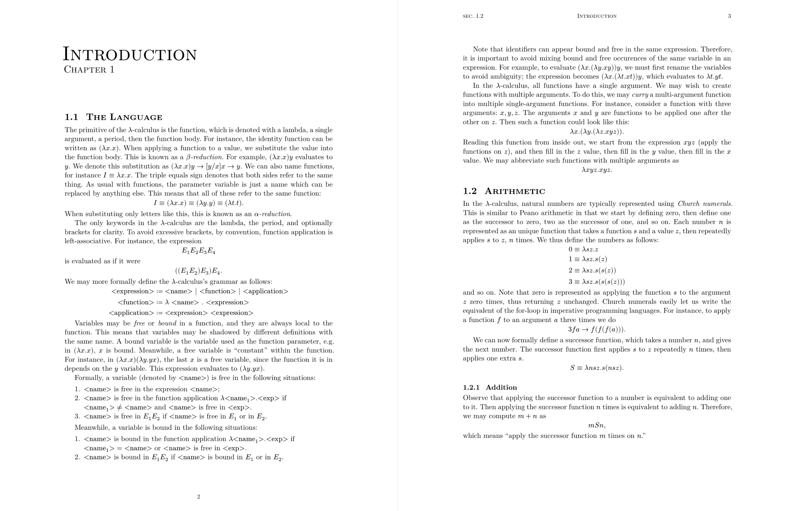

**Mousse notes** is a template for typesetting notes in [Typst](https://typst.app),
inspired by typical LaTeX styles.



To use it, install this package to your local system (this package is currently not published to Typst Universe):

```
git clone --depth 1 --branch 0.5.0 --single-branch https://github.com/dogeystamp/mousse-notes.git .local/share/typst/packages/local/mousse-notes/0.5.0
```

Then you can initialize a Typst project as follows:

```
typst init @local/mousse-notes [directory name]
```

- The main template entry point is the `book` function,
- Functions for math are given: `theorem`, `lemma`, `corollary`, `definition`,
    `example`, `solution`, `proof` and `remark`.
    You may create your own theorem environments with the `thmenv` function.
- A `glue` function is also given to work around Typst's page-breaking and prevent paragraphs and math equations from being split apart.
- The `tablef` function is a wrapper over `table` that provides LaTeX-style tables.

The default template provides example usages of some of these functions.
Math equations are automatically numbered if they are assigned a label.
